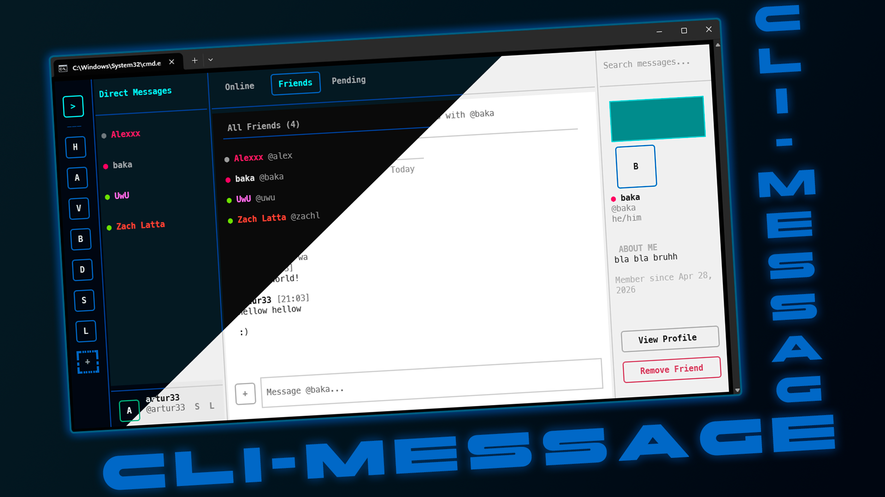

# CLI-Message



A terminal-based messaging application written in Python. Chat in real time with friends and communities, all from your command line, through a TUI made with `textual`.

> _Inspired by Discord ofc lol: servers, channels, DMs and all..._

> _This project mainly served as a learning experience with Textual TUI framework and a bit for SQLite-based databasesss_

## Table of Contents

- [Features](#features)
- [Requirements](#requirements)
- [Installation](#installation)
- [Directory Tree](#directory-tree)
- [Getting Started](#getting-started)
- [Settings](#settings)
- [AI Usage](#ai-usage)
- [License](#license)

## Features

- **Authentication:** Register and login with username/password.
- **Servers:** Create or join servers using invite codes. Each server has its own channels and member list.
- **Channels:** The Owner can create text channels inside servers.
- **Direct Messages:** Send and receive DMs with friends. Includes a friend request system with pending/accepted states.
- **Notifications and unread badges:** Unread message counts are tracked per channel, per server and per dm + mention notifications.
- **Message Features:** Reply to messages, edit and delete your own messages, and attach files. Mentions (`@username`) are highlighted inline and the mentioned user is notified.
- **Presence:** Set your status to `online`, `dnd`, `invisible` (and `offline`). Presence is updated automatically on launch and exit.
- **Profile Customization:** Set a display name, bio, pronouns, status, name color, accent (banner) color and connections.
- **Compact Mode:** Toggle a condensed message view that groups consecutive messages from the same user.
- **Themes:** Switch between dark and light UI themes.
- **Real-time Updates:** Messages, notifications, member lists, and unread badges refresh automatically via polling intervals.
- **Image Support:** Send and display image attachments inside the chats (uses `textual-image`, so for some terminals it may not work).
- **Settings:** Configure user, notifications, theme, and compact mode.
- **SQLite Database:** All data is stored in a local SQLite3 database.
- **Textual TUI:** The entire interface is built with the Textual framework waaaaaa

## Requirements

- **Python:** 3.8 or higher
- **Dependencies:** Install via `requirements.txt`
  - `textual`
  - `textual-image`
  - `Pillow`
  - `rich`

## Installation

1. **Clone the repository** and navigate to the project folder:
   ```bash
   git clone https://github.com/artur3333/CLI-Message.git
   cd CLI-Message
   ```

2. **Install the required Python packages**:
   ```bash
   pip install -r requirements.txt
   ```

3. **Run the app:**
   ```bash
   python main.py
   ```

The SQLite database (`cli_message.db`) is created automatically on first run.

## Directory Tree

```
CLI-Message/
├── main.py          # Main application entry point launching the Textual app
├── auth.py          # Authentication & session management
├── db.py            # SQLite database layer
├── screens.py       # Textual screens and UI widgets
├── utils.py         # Utility functions & helpers
├── style.tcss       # Textual CSS stylesheet
└── cli_message.db   # SQLite database (auto-generated on first run)
```

## Getting Started

1. **Start the application**:
   ```bash
   python main.py
   ```

2. **Register** a new account on the login screen by entering a username and password and clicking **Register**.

3. **DMs tab** loads by default browse your friends list, send friend requests, and open conversations (you won't be able to do much because your account is new).

4. **Servers** can be accessed from the left sidebar. Click **+** to create a new server or join one with an invite code.

> You can open other instances of the app in separate terminal windows and create multiple accounts to test the messaging features between them.

5. Press **`Ctrl+Q`** to quit.

## Settings

Each user has their own settings, editable from the settings button (`S`) in the bottom-left corner (near the username).

| Setting | Description | Default |
|---------|-------------|---------|
| `dm_notifications` | Enable notifications for new DMs | `on` |
| `mention_notifications` | Enable notifications for `@mentions` | `on` |
| `compact_mode` | Compact grouped messages from the same user | `off` |
| `theme` | UI color theme (`dark` or `light`) | `dark` |

## AI Usage
 
Honestly, this project was a pain. Between Textual being unintuitive to structure at first, CSS constantly misbehaving, async refresh bugs, and all of this happening alongside other stuff, AI was consulted more than I originally planned. Most of the core logic was written independently, but there were moments where I was just too stuck to keep going without help. Here is where AI was used:
 
- **Live message updates (for last devlog)**
Getting the live chat refresh to work without either showing users the wrong messages or causing the entire chat to visually reload mid conversation was a challenge. Full reloads looked awful while someone was actively chatting, but partial updates kept breaking in different ways. AI was used to come up with a solution that would only update the messages that actually changed and keep the rest of the chat visually stable.
 
- **Light theme stylesheet**
Writing the full light mode style would have taken a long time at a point in the project where I was already trying to wrap things up. AI helped produce the initial version which I then adjusted when was adding new UI elements (after that update).
 
- **Styling and CSS**
Textual's CSS is a pain, at least for me, and small visual changes sometimes took way longer than expected. AI was used occasionally to fix layout bugs and get things looking fine especially during the servers/channels UI work and the profile panels.
 
- **Bug fixing throughout**
Various bugs were brought to AI when nothing was working and I wasn't sure how to proceed, it can be wrong message ordering from the database, Textual widget state issues, Terminal rendering problems, and other things that showed up everywhere in the code.
 
- **Documentation**
This README was partially generated by AI and then edited for accuracy.

## License
This project is licensed under the MIT License. See the [LICENSE](LICENSE) file for details
